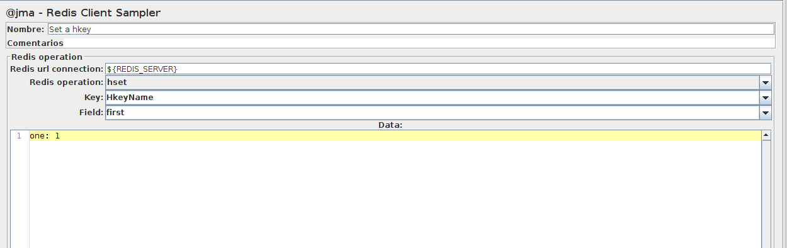

# Redis Sampler For JMeter

Apache jMeter sampler for access to redis DB. It implements a set of instructions to access to redis DB:

- keys
- type
- set
- get
- del
- hgetAll
- hget
- hdel
- hset
- hsetM
- ttl
- expire
- expireAt

More information in [redis web](https://redis.io/commands)

## Getting Started

### Dependencies

[jedis.2.9.0](https://mvnrepository.com/artifact/redis.clients/jedis/2.9.0)

### Installing

1 Copy the dependencies to lib/ext directory of jMeter.
2 Copy the project jar to lib/ext directory
  - Download the project.
  - Compile with maven.
  - Copy the result jar in lib/ext directory of jMeter.
  
  Or
  
  - [Download it](releases/jMeterRedisClient-1.1.0-SNAPSHOT.jar  "jMeterRedisClient-1.1.0-SNAPSHOT.jar")

## Use

**Redis url connection**: <server>:<port>.

**Redis operation**: one of the above redis commands.

**Key**: name of the key to save in redis.

**Field** (optional in some operations): third parameter of the command if it's necessary.

**Data** (optional in some operations): data to save in the key or key/field.

Download [Redis client sampler example file](resources/jmx_files/RedisClientExample.jmx "Redis client sampler example")

Load in jMeter and run it.

## Built With

* [Maven](https://maven.apache.org/) - Dependency Management
